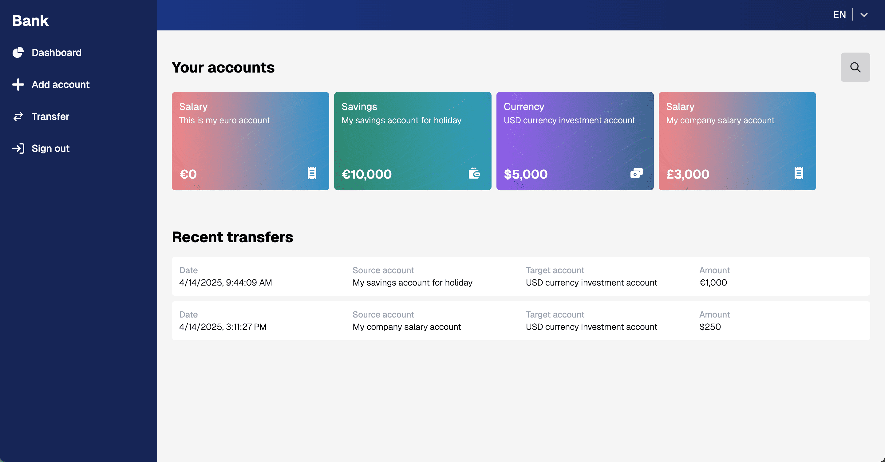

# Bank Account Management

[https://bank-account-management.vercel.app/](https://bank-account-management.vercel.app/)

Note: The application is deployed to a free hosting service, which means it may spin down after a period of inactivity. As a result, the initial load might take some time. If the page appears unresponsive, please try refreshing the page.

Features:

-   Create, list, update, delete and search accounts with different account types and currencies
-   Transfer funds between accounts in different currencies
-   Account balance validation with currency conversion
-   Playwright E2E tests for visual regression testing
-   CRUD json server to provide mock data
-   App router support, server actions and server components
-   Responsive design built with Tailwind
-   i18n support

# Getting Started

## Cloning

```bash
git clone https://github.com/zoltanMaroti/bank-account-management
```

## Prerequisites

-   [Node.js](https://nodejs.org/) 18.18 or later

## Environment Variables

To run this project, you will need to add the following environment variables to your .env.local file in the project root (see .env.example file)

```
API_URL="http://localhost:1111"
APP_ENV="dev"
```

## Installation

```bash
npm install
```

To run E2E tests, install Playwright browser binaries with the following command

```bash
npx playwright install
```

## Starting

```bash
npm run dev
```

Open [http://localhost:3000](http://localhost:3000) with your browser to see the result

## Running Tests

To run visual regression tests, run the following command

```bash
npm run test:e2e
```

To run unit tests, run the following command

```bash
npm run test:unit
```

To update screenshots, run the following command

```bash
npm run update-snapshots
```

Note: Visual regression tests may fail due to screen resolution differences. In such cases, regenerate the snapshots to align with the current environment before re-running the tests.

## Built With

-   [Next](https://nextjs.org/)
-   [React](https://react.dev/)
-   [Tailwind](https://tailwindcss.com/)
-   [Typescript](https://www.typescriptlang.org/)
-   [Playwright](https://playwright.dev/)
-   [Jest](https://jestjs.io/)

## Author

Zoltán Maróti [Github](https://www.github.com/zoltanMaroti) | [LinkedIn](https://www.linkedin.com/in/zoltan-maroti/)
